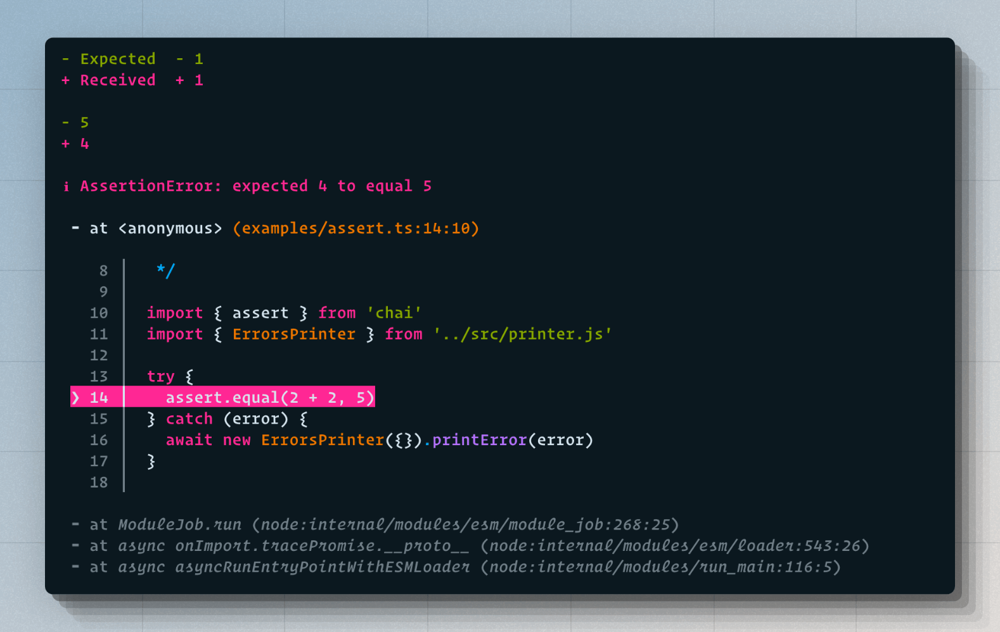
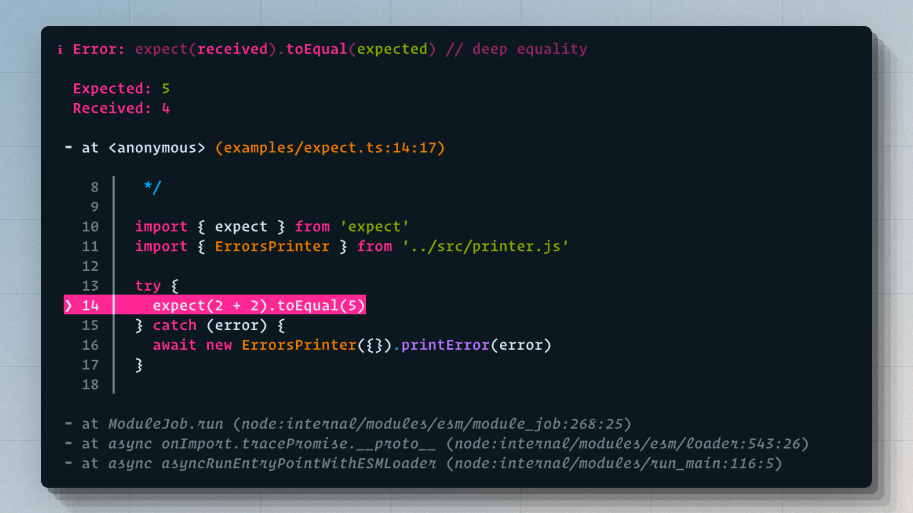
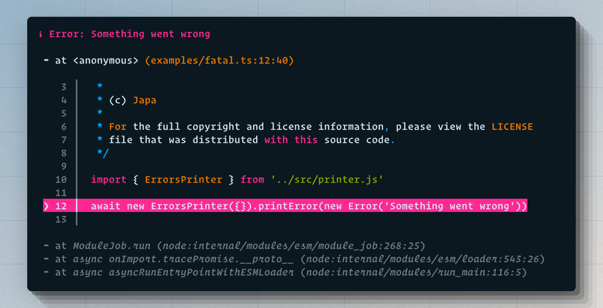

# show-screen-errors
> Impressora de erros para exibir mensagens de erro de forma clara e bonita no terminal.


## Instalação

Instale o pacote a partir do npm registry:

```sh
npm i @t8ngs/show-screen-errors
```

```sh
yarn add @t8ngs/show-screen-errors
```

```sh
pnpm add @t8ngs/show-screen-errors
```


## Uso

Você pode exibir erros de forma amigável no terminal utilizando o `show-screen-errors`:

```ts
import { printError, printErrors } from '@t8ngs/show-screen-errors'

try {
  // Algum código que pode lançar erro
  throw new Error('boom')
} catch (error) {
  await printError(error)
}
```

Para exibir múltiplos erros (exemplo: em um runner de testes):

```ts
import { printErrors } from '@t8ngs/show-screen-errors'

const errors = [
  { title: 'Teste 1', phase: 'test', error: new Error('Falha no teste 1') },
  { title: 'Teardown', phase: 'teardown', error: new Error('Falha no teardown') }
]

await printErrors(errors)
```


## API

### printError(error: unknown): Promise<void>
Exibe um erro no terminal, mostrando diff de asserção quando aplicável ou a stacktrace formatada.

**Exemplo de erro de asserção:**

```ts
import assert from 'assert'
import { printError } from '@t8ngs/show-screen-errors'

try {
  assert.equal(2 + 2, 5)
} catch (error) {
  await printError(error)
}
```



**Exemplo com expect:**

```ts
import expect from 'expect'
import { printError } from '@t8ngs/show-screen-errors'

try {
  expect(2 + 2).toEqual(5)
} catch (error) {
  await printError(error)
}
```



**Erro genérico:**

```ts
import { printError } from '@t8ngs/show-screen-errors'

await printError(new Error('boom'))
```



### printErrors(errors: Array<{ title: string, phase: string, error: Error }>): Promise<void>
Exibe uma lista de erros, útil para mostrar o resultado de múltiplos testes.

```ts
await printErrors([
  { phase: 'test', title: '2 + 2 = 4', error: new Error('Falha no teste') },
  { phase: 'teardown', title: '2 + 2 = 4', error: new Error('Falha no teardown') }
])
```

### parseError(error: unknown): Promise<object>
Retorna um objeto JSON com detalhes do erro, útil para logs ou inspeção programática.

```ts
import { parseError } from '@t8ngs/show-screen-errors'

try {
  expect(2 + 2).toEqual(5)
} catch (error) {
  console.log(await parseError(error))
}
```


---

> Projeto mantido por [t8ngs](https://github.com/t8ngs). Veja exemplos em `examples/` e contribua!
